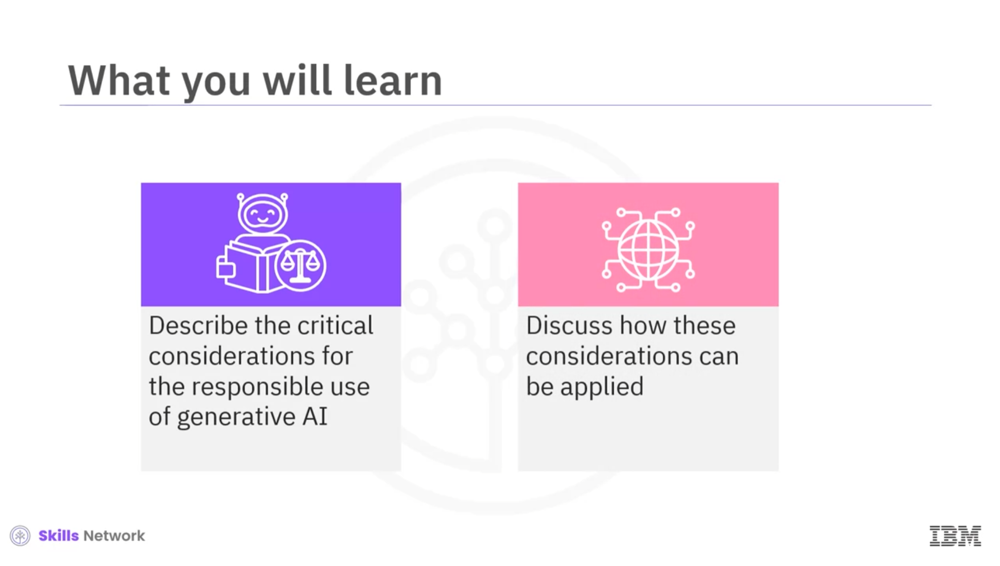
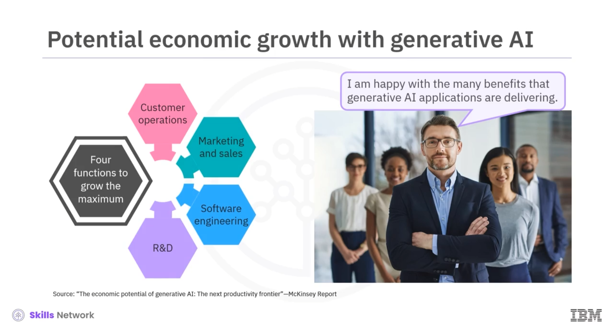
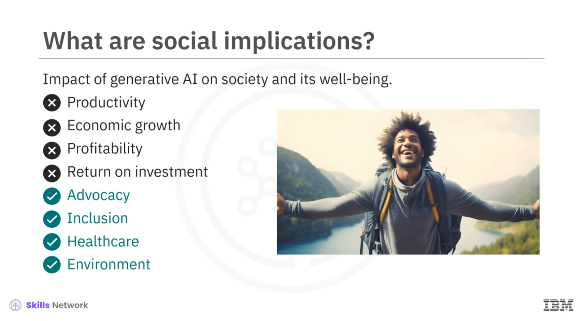

# Considerations for Responsible Generative AI

In this module, the critical considerations for the responsible use of generative AI are discussed. The ethical responsibility of corporations regarding generative AI are highlighted. Finally, the section gave insights into the perspectives and considerations of organizations, to implement responsible AI, and taught to evaluate the practical strategies employed by the key players to actively pursue their respective AI principles.

Following is the summary:

- The critical considerations for the responsible use of generative AI are transparency, accountability, privacy, and safety guardrails.

- Transparency refers to the openness and clarity in how AI models work, make decisions, and generate content.

- Accountability means holding individuals, organizations, and AI models responsible for the ethical and legal consequences of their AI-driven actions and decisions.

- Privacy refers to protecting personal data and ensuring that AI-generated content does not disclose sensitive or confidential information. 

- Safety guardrails in generative AI are measures, policies, and controls to ensure the safe and responsible use of generative AI models.  

- Professionals and organizations utilizing generative AI should carefully contemplate the ethical implications and assume responsibility for addressing the concerns associated with the use of this technology.

- Several organizations and projects provide resources for enacting AI ethics. Also, many organizations, including IBM, have developed their own point of view on AI ethics.

# Social Implications of Generative AI

This section talks about the economic and social impact of generative AI. The section presents the potential economic growth that businesses can achieve with generative AI and identifies how generative AI tools are reshaping job functions and profiles. The section also suggests that employee upskilling is the biggest challenge to workforce readiness in the context of generative AI. 

- Generative AI has a far-reaching impact on the global economy across sectors like customer operations, marketing and sales, software engineering, and research and development. The economy will benefit from increased efficiency and performance, new job roles, and professional growth.

- Generative AI has a significant impact on society as well, specifically in advocacy inclusion, healthcare, and the environment. Benefits include better healthcare systems and services and chatbots to fight loneliness. Challenges include digital exclusion, biased algorithms, digital dependency-induced loneliness, and a sizeable carbon footprint.    
- Generative AI tools increase transparency for all involved at all levels of operations, from ideas to implementation. Using these AI tools, corporate leadership is expected to refocus its corporate social responsibility efforts toward employee and community safety.

- Companies should initiate workforce transformation programs to enhance the skills of their current employees, aiming to minimize business disruptions while preparing a workforce that is adept and friendly with generative AI technologies.

