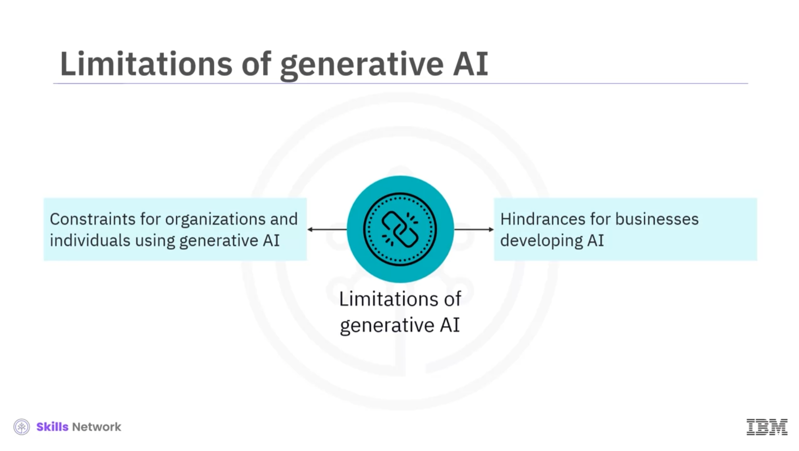

 # Limitations, Concerns, and Issues of Generative AI
 
 In this module, the various limitations, concerns, and ethical issues associated with generative AI are discussed and the challenges of training data used in generative AI are explored. The section talksabout the concerns around data privacy, copyright infringement, and hallucinations of text, image, and code-generating large language models (LLMs) in generative AI. Additionally, concerns about AI portraits and deepfakes in generative AI, along with their misuses are discussed.

Following is the summary:

- The fundamental limitation of generative AI is related to training data used for training generative AI models, which may be unavailable, outdated, or inaccurate. This training data limits the understanding and creativity of generative AI.

- Generative AI models sometimes lack explainability and interpretability, raising concerns about the accountability and reliability of generative AI.  

- Some common ethical concerns and issues around generative AI include inaccuracies and biases, data privacy and security, copyright infringement, and copyright ambiguity. A few reasons for these issues are the use of sensitive and confidential information for training the model and the lack of legally mandated regulations for developing or using AI-generated content.

- Hallucinations occur when generative AI models produce content that lacks a basis, leading to the generation of factually incorrect or incoherent text, images, and code. The reasons for these hallucinations could be natural language ambiguity, long-term dependency, and complex semantics.

- These hallucinations spread misinformation and can be harmful to society. There are techniques such as training on curated datasets, post-processing techniques, and prompt engineering to mitigate the negative consequences of these hallucinations. Documentation, error handling, and a close partnership between the LLM and software developers help prevent hallucinations in code-generating LLMs.   

- AI portraits are realistic portraits of individuals generated by machine learning algorithms using a diverse data set of artistically curated images. They can preserve cultural heritage and create new artistic possibilities.

- Generative AI can be misused to create deepfakes: videos, images, or audio recordings manipulated using generative AI models to make them appear as if they are real. Hence, developing ethical guidelines and new technologies to detect deepfakes is essential.

