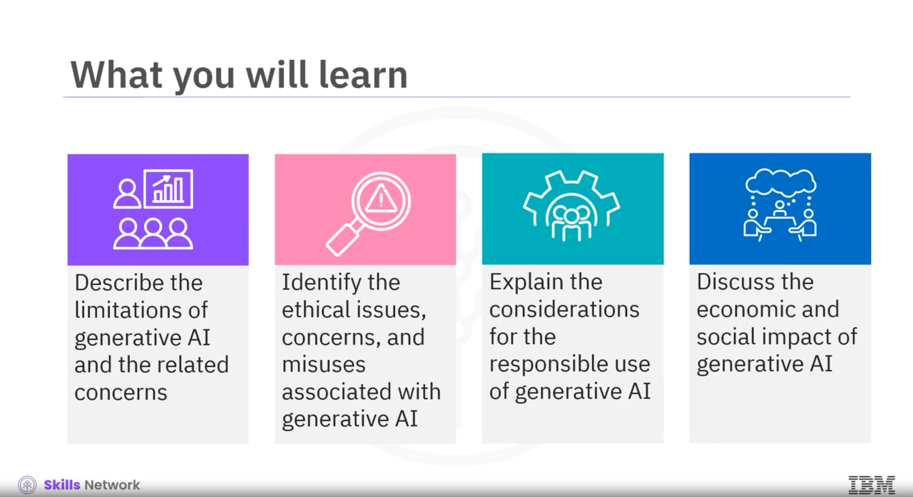
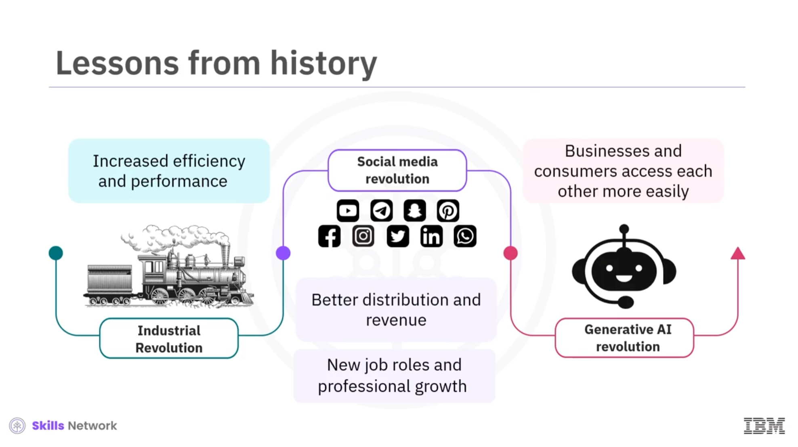

# Generative AI: Impact, Considerations, and Ethical Issues

The knowledge base contanis a specialization overview from the course [Generative AI: Foundation Models and Platforms](https://www.coursera.org/learn/generative-ai-ethical-considerations-and-implications) by [IBM](https://www.ibm.com/us-en) on [Coursera](https://www.coursera.org/). It is divided into following modules:
- [Considerations for Responsible Generative AI](ConsiderationsforResponsibleAI.md)
- [Limitations, Concerns, and Issues of Generative AI](LimitationsConcernsandIssuesofGenerativeAI.md)

## Glossary
Following alphabetized glossary contains many of the terms in this course. This comprehensive glossary also includes additional terms not used in course videos. These terms are essential for you to recognize for better comprehension of the concepts covered in the course.

| Term                                   | Definition                                                                                                       |
|----------------------------------------|------------------------------------------------------------------------------------------------------------------|
| Data augmentation                      | A technique commonly used in machine learning and deep learning to increase the diversity and amount of training data. |
| Deep learning                          | A subset of machine learning that focuses on training computers to perform tasks by learning from data. It uses artificial neural networks. |
| Deepfakes                              | Videos, images, or audio recordings that have been manipulated using artificial intelligence to make them appear as if they are real. They are also referred to as synthetic media. |
| Deepfake AI                            | A type of artificial intelligence used to create convincing images, audio, and video deceptions.                |
| Diffusion model                        | A type of generative model popularly used for generating high-quality samples and performing various tasks, including image synthesis. They are trained by gradually adding noise to an image and then learning to remove the noise. This process is called diffusion. |
| Discriminative AI                      | A type of artificial intelligence that distinguishes between different classes of data.                           |
| Discriminative AI models               | Models that identify and classify based on patterns they observe in training data. In general, they are used in prediction and classification tasks. |
| Foundational models                    | AI models with broad capabilities that can be adapted to create more specialized models or tools for specific use cases. |
| Generative adversarial network (GAN)   | A type of generative model that includes two neural networks: generator and discriminator. The generator is trained on vast data sets to create samples like text and images. The discriminator tries to distinguish whether the sample is real or fake. |
| Generative AI                          | A type of artificial intelligence that can create new content, such as text, images, audio, and video.              |
| Generative AI models                   | Models that can understand the context of input content to generate new content. In general, they are used for automated content creation and interactive communication. |
| Generative pre-trained transformer (GPT) | A series of large language models developed by OpenAI. They are designed to understand language by leveraging a combination of two concepts: training and transformers. |
| Hallucinations in AI                   | A model output that is either meaningless or outright false. Hallucinations can happen on all kinds of data like text, image, audio, video, and code. |
| Large language models (LLMs)           | A type of deep learning model trained on massive amounts of text data to learn the patterns and structures of language. They can perform language-related tasks, including text generation, translation, summarization, sentiment analysis, and more. |
| Machine learning                       | A type of artificial intelligence that focuses on creating algorithms and models that enable computers to learn and make predictions or decisions. It involves designing systems that can learn from training data. |
| Natural language processing (NLP)      | A branch of artificial intelligence that enables computers to understand, manipulate and generate human language (natural language). |
| Neural networks                        | Computational models inspired by the structure and functioning of the human brain. They are a fundamental component of deep learning and artificial intelligence. |
| Personally identifiable information (PII) | Data "that directly identifies an individual, e.g., name, address, social security number or other identifying number or code, telephone number, and email address". Source: US Department of Labor |
| Prompt                                 | Instructions or questions that are given to a generative AI model to generate new content.                        |
| Training data                          | Data (generally, large datasets that also have examples) used to teach a machine learning model.                   |
| Transformers                           | A deep learning architecture that uses an encoder-decoder mechanism. Transformers can generate coherent and contextually relevant text. |
| Variational autoencoder (VAE)          | A type of generative model that is basically a neural network model designed to learn the efficient representation of input data by encoding it into a smaller space and decoding back to the original space. |

## Specialization Overview
###  Generative AI for Everyone specialization
This [Generative AI Fundamentals Specialization](https://www.coursera.org/specializations/generative-ai-for-everyone) provides a comprehensive understanding of the fundamental concepts, models, tools, and applications of Generative AI, empowering you to apply and unlock its possibilities. 

In this specialization, you will explore the capabilities and applications of Generative AI. You will learn about the building blocks and foundation models of Generative AI. You will explore Generative AI tools and platforms for diverse use cases. Additionally, you will learn about prompt engineering, enabling you to optimize the outcomes produced by Generative AI tools. Further, you will gain an understanding of the ethical implications of Generative AI in relation to data privacy, security, the workforce, and the environment. Finally, the specialization will help to recognize the potential career implications and opportunities through Generative AI. 

This specialization is intended for:
- Working professionals who want to enhance their careers by leveraging the power of generative AI
- Technophiles who wish to stay updated with the advancements in AI
- Individuals seeking an introduction to generative AI and a seamless experience through the world of Generative AI
- Managers and executives who want to leverage generative AI in their organizations
- Students who wish to graduate with practical AI skills that will enhance their job-readiness

### Specialization Content

The Generative AI for Everyone specialization comprises five short courses.
- Course 1: Generative AI: Introduction and Applications
- Course 2: Generative AI: Prompt Engineering Basics
- Course 3: Generative AI: Foundation Models and Platforms
- **Course 4: Generative AI: Impact, Considerations, and Ethical Issues**
- Course 5: Generative AI: Future and Career Growth

Most of the content is from the course itself. © IBM Corporation 2023.